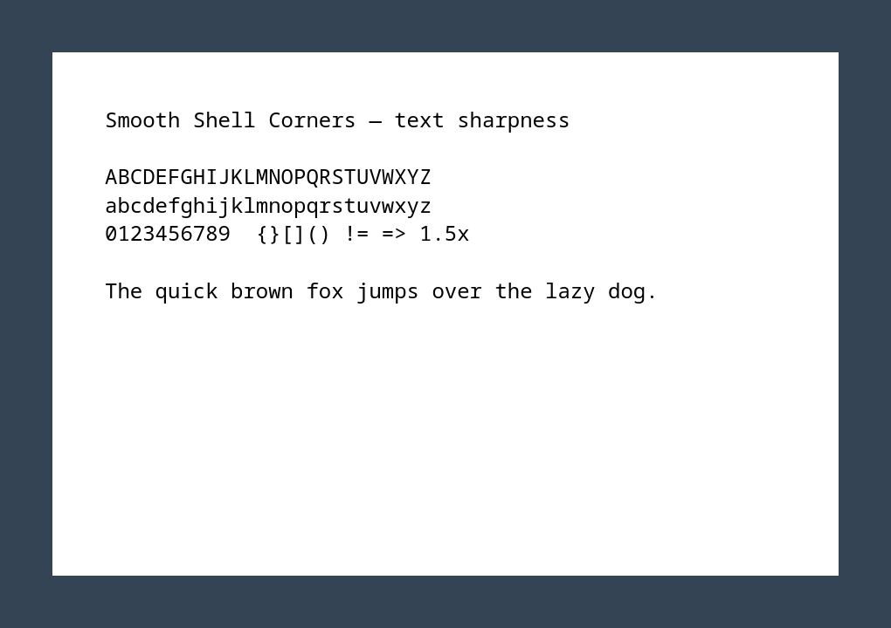

# Smooth Shell Corners

Consistent squircle corners across GNOME windows, with crisp text at fractional scaling.

| Extension off | Smooth Shell Corners |
|:--:|:--:|
|  |  |

Actual GNOME Shell 50.4 captures at 150% scaling using a GTK4 sample window.
Demo settings: radius 12, smoothing 0.6, custom shadows on. These are a subtle
preset, not the extension defaults. [Capture details](docs/images/README.md).

[Download](https://github.com/sssxks/smooth-shell-corners/releases) ·
[Settings guide](docs/guide.md) ·
[Report a problem](https://github.com/sssxks/smooth-shell-corners/issues/new/choose) ·
[Help test](docs/testing.md)

## Why this extension?

- Adjust corners from circles to squircles, with optional borders and shadows.
- Preserve text sharpness at fractional scaling with pixel-aligned rendering.
- Fill narrow clipped application borders with pixels from inside the window.
- Replace native GTK4 corners, or keep toolkit styling and exclude individual apps.

This is a fork of [Rounded Windows](https://github.com/Nathanaelrc/rounded-windows).
Its focus is rendering quality: fractional-scale text, clipped edges, and consistent
corners and shadows. It has separate settings; enable only one window-corner
extension at a time. There is no published head-to-head comparison with other extensions.

## Compatibility and current limits

Early preview. Locally tested on **Bazzite, GNOME Shell 50.4, Wayland**.
The isolated compositor checks cover 100%, 125%, 150% and 200% scaling.
Metadata also allows GNOME 45–49, but this fork's renderer has **not been verified**
on those versions. Mixed-monitor setups and interactions with other window effects
need testers. [Testing scope and known limits](docs/testing.md).

Corners apply to top-level windows; some menus, tooltips and app-drawn surfaces
remain unchanged. Filling borders can stretch edge content such as scrollbars.

**Native GTK4 corner replacement is enabled by default.** It manages a marked CSS
block in host and existing Flatpak GTK4 configuration files. Restart GTK4 apps
after enabling or disabling it. You can turn it off in Applications settings.
The override also affects GTK4 windows excluded from the extension's filters.
[Details and recovery](docs/guide.md#native-gtk4-corner-removal).

## Install a release

Download `smooth-shell-corners@xks.shell-extension.zip` from
[Releases](https://github.com/sssxks/smooth-shell-corners/releases).
Open a terminal in the download folder and run:

```bash
gnome-extensions install --force smooth-shell-corners@xks.shell-extension.zip
```

Disable any other window-corner extension in the Extensions app. Log out and
back in, then enable **Smooth Shell Corners** in Extensions, or run:

```bash
gnome-extensions enable smooth-shell-corners@xks
gnome-extensions prefs smooth-shell-corners@xks
```

Restart GTK4 apps so native corner replacement takes effect. Release ZIPs need
no Node.js, npm, or source compilation. The extension is not yet listed on
extensions.gnome.org.

## Remove

Disable **Smooth Shell Corners** in Extensions and restart affected GTK4 apps
before removing it, or run:

```bash
gnome-extensions disable smooth-shell-corners@xks
# Restart affected GTK4 apps, then:
gnome-extensions uninstall smooth-shell-corners@xks
```

If Shell crashed before cleanup, see [CSS recovery](docs/guide.md#native-gtk4-corner-removal).

## Build from source

Requires Git, Node.js 24 with npm, and `glib-compile-schemas`. On Bazzite the
GLib tool is already available; keep Node.js in your user environment.

```bash
git clone https://github.com/sssxks/smooth-shell-corners.git
cd smooth-shell-corners
npm ci
./install.sh
```

Log out and back in, enable the extension, then restart GTK4 apps as above.
For development use `just check`; `just pack` builds the installable ZIP.
[Architecture and rendering tests](docs/guide.md#development-checks).

## Help shape the first release

Looking for **five people to try it for a week**. Tell us your GNOME version,
GPU, scaling and apps, then whether you kept it enabled and why.
[Quick test and feedback instructions](docs/testing.md).

## Credits and license

Forked from [Nathanaelrc/rounded-windows](https://github.com/Nathanaelrc/rounded-windows),
with code and ideas from [yilozt/rounded-window-corners](https://github.com/yilozt/rounded-window-corners)
and [flexagoon/rounded-window-corners](https://github.com/flexagoon/rounded-window-corners).
See [AUTHORS](AUTHORS) for attribution included in release packages.
Licensed under [GPL-3.0-or-later](LICENSE).
